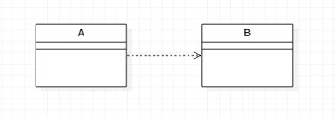

## 소개글
스프링 공부를 시작하고, 추상화된 라이브러리나 모듈만을 사용하다 보니 핵심적인 부분에 대해서 부족하다라는 생각을 점점하게 되었고, 이를 보충하기 위해서 토비의 스프링 3.1 을 읽으면서 부족한 부분에 대해서 정리를 해보려고 합니다. 

## 목차
- 싱글톤 레지스트리로서의 애플리케이션 컨텍스트 
- 의존관계 주입(DI)

# 1. 싱글톤 레지스트리로서의 애플리케이션 컨텍스트 
우리는 스프링 코드를 만들고 UserDao 를 호출하면 항상 같은 오브젝트가 돌아오는 것을 확인할 수 있다. 
그렇다면 왜 이 오브젝트들이 같은 오브젝트가 돌아오는 것일까? 그것은 바로 Application Context 가 별도의 설정을 해주지 않으면 기본적으로 싱글톤으로 구동하기 때문이다. 

### 그렇다면 왜 서버에서 오브젝트를 싱글톤으로 만드는걸까 ?

우선 스프링이 등장한 배경에 대해서 생각해보아야 한다. 당시 웹은 초당 수백번에서 많게는 몇 천번의 요청이 들어온다. 
요청 당 오브젝트가 5개가 만들어진다고 생각해보자. 그렇다면 요청이 2000개만 들어와도 서버에는 10000개의 오브젝트가 만들어지는 것이다. 아무리 자바의 성능이 좋아졌다고 해도 이렇게 많은 양의 오브젝트를 찍어낸다면 서버도 힘들것이다.
그러므로 스레드를 여러개 두고 제한 된 오브젝트를 둠으로써 관리하게 된다. 하지만 싱글톤 패턴에는 생각보다 많은 단점이 있다. 그래서 몇몇 사람들은 싱글톤 패턴을 안티 패턴이라고 부른다. 

### 어떤 단점이 있나? 
우선 싱글톤 패턴을 구현하는 방법은 인스턴스 변수를 private 로 설정하고 이 변수가 가르키는 오브젝트를 가져오는 getInstance() 메서드를 통해 오브젝트를  싱글톤으로 사용할 수 있게 합니다. 이렇게 구현된 싱글톤의 문제점에 대해서 살펴보도록 하겠습니다.  
 첫 번째로 private 을 붙이므로써 상속이 불가능해지고, 상속이 불가능해지므로써 자바의 큰 장점인 다형성을 사용할 수 없게 된다는 단점이 발생하게 됩니다.  
 두 번째로 테스트에 부적합하다는 것입니다. 생성자 주입을 통해 테스트를 진행하여야 하지만 private 로 인해 생성을 할 수 없을 뿐더러 혹시나 직접 생성하는 로직을 작성해서 하더라도 비효율적인 방법이 될 것입니다.  
 세 번째로 싱글톤이 무조건 보장되지는 않는다 입니다. 서버는 특정상 많은 클라이언트의 JVM 환경에서 사용되기 때문에 많은 오브젝트들이 만들어진다고 볼 수 있습니다. 이러한 부분에서 싱글톤을 유지한다라고 말하기 어렵습니다.  
 마지막으로 싱글톤의 static 메서드를 통해서 어디서든 접근해 사용할 수 있어서 전역 상태가 될 수 있습니다. 전역 상태가 되는 것은 프로그램 관점에서 잘못된 설계라고 할 수 있습니다. 

 ## 싱글톤 레지스트리는 무엇인가? 
 스프링 진영에서는 싱글톤 패턴을 이용하는 서버를 적극적으로 지지한다. 하지만 이 글에서 표현했듯이 Java 로 생성하는 싱글톤 패턴에는 많은 단점이 있다. 하지만 Spring 에서는 IoC 를 해주는 컨테이너가 있기 때문에 private 과 static  메서드를 활용하는 방법이 아니라 평범한 자바 클래스를 활용해 생성과 관계 설정 등 사용에 대한 제어권을 container 에게 일임해 싱글톤으로 가능하게 합니다. 
 손 쉽게 싱글톤 컨테이너를 만들수 있다. 오브젝트를 관리하는 모든 권한을 IoC를  관리하는 어플리케이션 컨텍스트에 위임하기 때문이다. 

스프링이 곧 ApplicationContext 고, Application 이 IoCContainer 이다.

## 싱글톤과 오브젝트의 상태 
서버에서 오브젝트를 싱글톤으로 생성하기 위해서는 stateless 한 상태여야 한다. 쉽게 설명하자면 stateFull 한 상태에서는 서버에서 다중 스레드에서 접근하는 정보를 가지고 있기 때문에 원하는 데이터가 담기지 않는 치명적인 문제가 발생합니다. 그러므로 싱글톤 레지스트리를 가지는 서버는 stateless 해야 하는 특징을 가집니다. 그렇다면 stateless 한 상태에서 요청이 들어온 데이터를 어떻게 기억하고 사용하는 것일까? 그것은 바로 한번 쓰고 버릴 수 있는 변수들을 사용하면 된다. 로컬 변수를 사용해서 데이터를 사용하고 버리면 되는 것이다. 

## 스프링 빈의 스코프
스프링 빈은 저번 시간 포스팅 했던 글과 동일하게 런타임 시에 등록이 되고 사용이 된다. 하지만 빈은 IoCContainer 에서 관리되기 때문에 스프링 빈의 스코프 또한 스프링 컨테이너와 동일하다는 것을 알 수 있습니다.

# 2. 의존관계 주입(DI)
IoC 와 DI 는 뗼레야 땔 수 없는 스프링의 중요한 개념이다. 
IoC 컨테이너는 객체의 생성을 담당하고 객체들과의 관계를 일반화한 기능이다. 

하지만 이 모든 개념을 IoC Container 라고 표현하기에는 문제가 많다고 생각한다. 그래서 스프링 진영에서는 DI 라는 개념을 만들기 시작했다. Dependency Injection 언어는 원래 의존 오브젝트 주입이라는 단어로 시작되었다. 하지만 DI 의 내부 로직을 살펴보면 오브젝트 자체의 주입이 아닌, 레퍼런스를 주입해주는 것이다. 그러므로 의존 오브젝트 주입이 아닌 의존관계 주입이라는 단어나 의존관계 설정이라는 단어를 쓰는 것이 적합하다고 생각한다.    
오늘 가장 인상에 깊었던 문장은 이것인거 같다.  
무언가의 이름을 정할때에는 사용법이 아니라 의도에 대해서 생각하고 이름을 정하는 것이 맞다 라는 문장이 가장 기억에 남는다. 

### 의존? 의존관계가 무엇인지에 대해서 알아보도록 하자. 
의존 관계란 무엇일까? 라는 의문에 대해서 깊게 고민했던적은 없는거 같다. A 와 B 오브젝트가 있다 라고 했을 때 B가 변화 했을 때 A가 변화에 영향을 받으면 A 는 B를 의존하고 있다고 말할 수 있다. 
  
UML 을 그려서 나타냈을 때 A 와 B 의 의존관계를 나타낸 것이다. 

여기서 B 가 변경되면 A 가 영향을 받게 된다. 이 경우에 A 가 B 를 의존하고 있다는 것이다. 꼭 기억하자. 의존관계에는 방향성이 존재한다. 
 
 
그렇다면 A 가 B 를 의존하는 관계이다. 그렇다면 위의 이미지처럼 의존관계를 가지고 있다면 그것은 느슨한 관계라고 말할 수 있을까?  

스프링에서는 느슨한 결합을 템플릿 메서드 패턴을 통해서 사용하게 된다. A 에서는 인터페이스의 정보만 가지게 있고, 실제 구현 오브젝트의 정보는 가지고 있지 않다. 런타임 시에 구현 오브젝트를 결정해주는 것을 의존관계 주입이라고 하는 것이다.  

그렇다 스프링에서 말하는 의존관계의 주입에는 3가지 조건 충족이 필요하다. 
- 클래스 모델이나 코드에서 런타임 시점까지 의존관계가 드러나서는 안된다. 그말인 즉슨 인터페이스만을 참조하고 있어야 한다는 것이다. 
- 런타임 시점의 의존관계는 컨테이너나 팩토르 같은 제 3의 존재(IoCContainer, DI Container 등)(이)가 결정한다. 
- 의존 관계를 주입하는 것은 런타임 시점에 사용할 오브젝트의 레퍼런스를 제 3의 존재가 넣어주는 것을 말한다. 
 

예시를 UserDao 와 DConnectionManager 클래스가 있다고 가정하고 예시를 설명해보도록 하겠다. 
UserDao 를 기준으로 의존관계를 주입받는 것을 한번 알아보도록 하자. UserDao 는 ConnectionManager 라는 인터페이스를 가지고 있다. 이 인터페이스 타입을 기준으로 구현 객체를 주입해주는 것이다. 자바에서 주입이라는 개념은 오브젝트 자체를 주입하는 것이 아니라, 오브젝트의 레퍼런스를 주입하는 것이다. 그래서 의존오브젝트 주입이 아니라 의존관계 주입이라고 표현하는 것이다. 인터페이스를 기준으로 타입을 매치하고 의존관계를 생성자로 주입해주는 것이다. 

