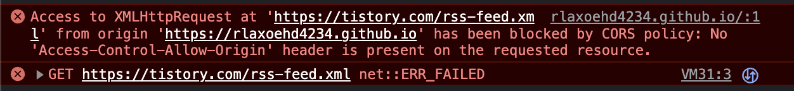

## 개요
프론트, 백 협업을 하다보면 항상 만나게 되는 지긋지긋한 CORS 에 대해서 알아보도록 하자.

## 목차
- CORS 란 ?

### CORS 란 ?
CORS 라는 메커니즘은 왜 나오게 된 것일까?  
CORS 를 설명하기 전에 CSRF 에 대해서 먼저 알아보자.   
"이전의 웹 생태계에서는 오리진이 다르면 요청을 주고 받을 수 없는 환경이었다."
 
 
하지만 이 글을 보고도 필자는 이해가 한번에 되지 않았다. 오리진이란 뭘까? 왜 오리진이 다르면 요청을 주고 받을 수 없었을까 라는 생각으로 시작하게 된 것 같다. (어쩌면 개발자로서의 자격이 없는 생각일수도 있겠다.) 
 
예전의 웹 생태계에서는 오리진이 아닌 다른 도메인으로 요청을 보내면 악의적인 행동이라고 생각했다고 한다. 그 이유에 대해서 생각해보자. 
 
악의적인 생각을 가지고 결제사이트를 흉내 낸 악당들이 있다고 가정하겠다. 필자는 쿠팡에서 쇼핑을 하다가 결제페이지로 넘어가게 되었다. 그런데 이 악당들이 자기들이 흉내 낸 결제 페이지로 요청을 보내버리는 것이 아닌가 그렇다. 필자는 방금 사기를 당한 것이다. 이 처럼 하나의 도메인이 아닌 다른 도메인에 요청을 보낼 수 있게 된다면 필자처럼 사기를 당하는 사람이 많아질 것이다. 그럼 이 문제를 해결 하기위해 개발자들은 어떻게 했을까?   
여기서 우리는 <b> 동일출처 정책 (same-origin policy, SOP) 에 대해서 알게된다. </b> 동일출처 정책이란 어떤 오리진에서 가져온 문서, 스크립트를 다른 출처에서 가져온 리소스와 상호작용하는 것을 제한하는 보안 방식이다. 

예시를 가볍게 한번 들어보도록 하겠다 same-origin 은 오리진이 같아야 한다고 말했다.  
필자가 백엔드 서버를 열심히 구축하고 REST 하게 만들었다. 프론트 개발자님 백엔드 API 명세서 보내드릴게요. 프론트 엔드 개발자가  <b>
 " 룰루랄라, 이제 서버에 데이터 요청해서 데이터를 뿌려볼까?? , 룰루 어디 보자, localhost:8080/babobabo/taedong 어..라 왜 에러가 발생하지? " </b>

 이 상황에서 발생하는 것이 same-origin 정책(이 정책이 위반 되지 않는 조건 3가지는 아래에서 설명하도록 하겠다.)을 위반하게 되는것이다.  
 프론트 엔드 서버는 localhost:3000 도메인을 가지게 되고 localhost:8080 도메인을 가지는 백엔드 서버로 호출을 하는 것이다. 그러면 도메인이 다르게 되어 에러가 발생하게 되는 것이다. 

 웹 생태계가 발달하면서 웹에는 부가적인 수많은 기능들이 생겨나게 되었다. 그래서 REST 한 백엔드 서버가 만들어지게 되고, 프론트 서버와 백엔드 서버가 분리되게 되었습니다.   계속 이렇게 불편한 상황을 개발자들은 어떻게 해결하려고 했을까?  
 그렇다. 이제 모든 개발자들이 한번쯤은 기피하게 된 CORS 메커니즘이 나오게 된 것이다. CORS 메커니즘은 same-origin 정책을 어기게 되더라도 HTTP 통신을 할 수 있는 것이다. 즉, CORS 정책은 SOP 의 예외 조항인 것이다. 
  
  
  
  

그럼 그 잘난 <b> CORS 어떻게 하는건데 ?</b> 필자도 이 글을 작성하기 위해 여러가지 소스를 보던중 메커니즘은 굉장히 간단한 것을 보고 놀라게 되었다.  
출처가 다른 서버로 리소스를 요청한다. 이때 브라우저는 요청 헤더에 Origin 이라는 필드에 요청을 보내는 출처를 함께 담아서 보내게 된다. 이후 서버가 이 요청에 대한 응답을 할때 응답헤더에 Access-Control-Allow-Origin 이라는 값에 "이 리소스를 접근하는 것이 허용된 출처" 를 내려주고, 이후 응답을 받은 브라우저는 자신이 보냈던 요청의 Origin과 서버가 보내준 "리소스를 접근하는 것이 허용된 출처" 비교해본 후 이 응답이 유요한 응답인지 아닌지를 결정한다. 

생각 보다 굉장히 간단하지 않은가 ?  
더 쉽게 설명해보도록 하겠다. 클라이언트가 작업을 위해 서버로 요청을 보낸다. 이때 브라우저는 요청 헤더 Origin 필드에 요청 오리진을 담아서 보내게 된다. 이를 확인한 서버에서는 응답 헤더에 "접근이 가능한 리소스 출처" 를 보내게 된다. 간단하지 않은가? 메커니즘은 간단하지만 내부적으로 CORS 가 동작하는 방법은 3가지가 있다. 이 3가지에 대해서 알아보고 정리해 보도록 하겠다.   

CORS 는 3가지의 타입을 구분 된다고 한다. 브라우저가 요청 내용을 분석하고 한가지 방식을 선택해 서버에 요청하기 때문에, 개발자는 목적에 맞는 방식을 선택하고 조건에 맞춰 코딩해야 한다.   
- PreFlight Request
- Simple Request
- Credentialed Request
  

아래에서 하나하나 설명하도록 하겠다. 

### Preflight Request 
simpleRequest 의 조건이 해당되지 않을 경우 이 방식으로 CORS 를 검증하게 된다. 
이 방식으로 진행 될 때 브라우저는 리소스에 요청을 보낼 때 2가지 단계로 나눠서 보내게 된다. 예비 요청과 본 요청을 보내는 것이다.  
 naver.com 에 리소스 요청을 보낸다. 그러면 브라우저는 예비 요청을 먼저 서버로 보내게 되고, 서버는 예비 요청(OPTIONS 메소드가 사용 됨.)에 대한 응답 헤더에 ORIGIN 의 정보를 다 담아서 보내 준다. 브라우저는 자신이 보낸 예비 요청과 서버의 허용 정책을 비교한 후, 이 요청이 안전하다고 판단이 되면 같은 엔드포인트로 본 요청을 다시 보내게 된다. 

티스토리 서버는 Access-Control-Allow-Origin : https://tistory.com 를 보내준다. 하지만 필자의 요청 도메인은 https://rlaxoehd4234.github.io 이기 때문에 CORS 에러가 발생하는 것을 알 수 있는 것이다. 

하지만 여기서 fetch 로 요청을 했을 때 에러가 발생하지 않고 200 이 발생한 것을 알 수 있다. 

이 요청에서 알 수 있듯이 CORS 에러가 발생해도 200이 발생하는 것을 알 수 있따. 중요한 것은 예비 요청의 성공/ 실패의 여부가 아니라 <b>응답 헤더에 유효한 Access-Control-Allow-Origin 값이 존재하느냐 이다.</b> 만약 200 이 아닌 상태 코드가 발생하더라도 헤더에 저 값이 제대로 들어가있다면 CORS 정책 위반이 아니라는 것이다.   

### Simple Request 
단순 요청은 예비 요청을 보내지 않고 바로 서버에게 본 요청부터 때려박은 후, 서버가 이에 대한 응답의 헤더에 Access-Control-Allow-Origin 과 같은 값을 보내주면 그때 브라우저가 CORS 정책 위반 여부를 검사하는 방식이다. 

즉, 전반적인 시나리오는 Preflight Request 의 본 요청과 다르지 않다. 예비 요청의 존재 유무만 다른 것이다. 하지만 아무때나 단순 요청을 할 수 있는 것은 아니고, 특정 조건을 만족하는 경우에만 예비 요청을 생략할 수 있다. 하지만 이 조건이 까다로워서 거의 적용이 되지 않는다고 말할 수 있다. 

 

### Credentialed Request 
3번째 방법은 인증된 요청을 사용하는 방법이다. 

기본적으로 브라우저가 제공하는 비동기 요청 API인 XMLHttpRequest 객체나 fecth API 는 별도의 옵션 없이는 절대 쿠키 정보나 인증 관련된 헤더를 함부로 요청에 담지 않는다. 이때 요청에 인증과 관련된 정보를 담을 수 있게 해주는 옵션이 바로 credentials 옵션 이다.
  
만약 여러분이 same-origin 이나 include 와 같은 옵션을 사용하여 리소스 요청에 인증 정보가 포함된다면, 이제 브라우저는 다른 출처의 리소스를 요청할 때 단순히 Access-Control-Allow-Origin 만 확인하는 것이 아니라 좀 더 빡빡한 검사 조건을 추가하게 된다. 

