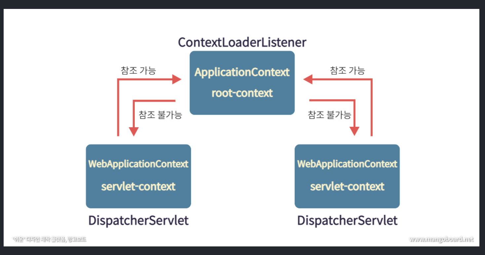

## 개요 
교육을 받으면서 root-context 와 servlet-context 에 대해 알게 되었다. 
하지만 이부분에 대해서 확실한 개념이 없기 때문에 정리해보려고 한다. 

## 목차
- Dispatcher Servlet 의 내부원리
- Root context 와 Servlet Context 의 역할 

### Dispatcher Servlet 의 개요 및 역할 
우선 Dispatcher Servlet 의 뜻에 대해서 생각해보자 "dispatcher" 라는 단어는 "보내다" 라는 뜻을 가지고있다. dispatcher servlet 은 http protocol 로 들어오는 모든 요청을 적합한 컨트롤러를 매핑하고 위임해주는 것을 말한다. 
이 과정이 없다면 우리는 Web.xml 에 모든 servlet 매핑을 위한 URL 을 등록해주어야 한다. 하지만 Dispatcher Servlet 이라는 개념이 발생하면서, 그 모든일들을 하지 않아도 되는 일이 발생한 것이다. 

  

하지만 장점이 있다면, 당연히 단점도 있을것이다. 원래 웹 서버에서는 동적인 컨텐츠는 servlet 으로 위임해주고, 정적인 컨텐츠는 웹 서버에서 처리 하는 과정이 있었다. 하지만 Dispatcher Servlet 을 도입하면서 그 부분에 대해 문제가 발생한것이다. 그렇다면 이 일을 어떻게 해결할까?  

우선 http protocol 로 들어오는 요청을 1차 적으로 Dispatcher Servlet 에서 컨트롤러를 매핑하고 조회한다. 그 후에 매핑이 안된다면 2차적으로 Resource 경로를 탐색하면 된다. 이렇게 분리하면 효율적으로 사용이 가능하다. 

이제 그러면 Dispatcher Servlet 이 하는 역할을 한번 살펴보도록 하겠다. 그 과정에 대해서도 이해하고 있으면 좋을 듯 하다. 

1. 요청 받기

dispatcher servlet 은 클라이언트로 요청을 받는다. 클라이언트에서 지가해서 필터를 지나 dispatcher servlet 으로 이동한다고 생각하면 된다. 

2. 요청 정보를 통해 컨트롤러 매핑

@Controller 로 요청을 받는다고 생각해보자. 이 방식은 RequestMappingHandlerMapping 이 처리합니다. 이는 @Controller 로 작성된 모든 controller 를 찾아서 파싱하고 HashMap<요청 정보, 처리할 대상> 으로 관리합니다. 여기서 처리할 대상은 HandlerMethod 객체로 컨트롤러, 메소드 등을 갖고 있는데, 이는 스프링이 리플렉션을 이용해 요청을 위임하기 때문입니다. 요청이 오면 (Http Method 및 URI) 등을 사용해 요청 정보를 만들고, HashMap 에서 요청을 처리할 대상을 찾은 후에 HandlerExecutionChain으로 감싸서 반환 합니다. 이렇게 Chain 에 감싸는 이유는 컨트롤러로 요청을 넘겨주기 전에 <b>처리해야 하는 인터셉터 등을 포함</b>하기 위해서이다. 

3. 요청 컨트롤러로 위임할 핸들러 어댑터를 찾아서 전달 

이후 컨트롤러로 요청을 위임해야 한다. 하지만 스프링은 이 과정에서 HandlerAdapter 라는 어댑터 인터페이스를 통해 어댑터 패턴을 적용함으로써 컨트롤러의 구현 방식에 상관없이 요청을 위임할 수 있도록 하였다. 

4. 핸들러 어댑터가 컨트롤러로 요청을 위임함(핸들러 어댑터와 핸들러 인터셉터 )

핸들러 어댑터가 컨트롤러로 요청을 위임한 전/후에 공통적인 전/후처리 과정이 필요하다. 대표적으로 인터셉터들을 포함해 요청시에 @RequestParam, @RequestBody 등을 처리하기 위한 ArgumentResolver 들과 응답 시에 ResponseEntity 의 Body 를 Json 으로 직렬화 하는 등의 처리를 하는 ReturnValueHandler 등이 핸들러 어댑터에서 처리 됩니다. ArgumentResolver 등을 통해 파라미터가 준비되면 리플렉션을 이용해 컨트롤러로 요청을 위임합니다. 

5. 비즈니스 로직

이 후에 비즈니스 로직을 처리한다. 

6. 이후 컨트롤러가 반환값을 반환 함

비즈니스 로직이 처리된 후에는 컨트롤러가 반환값을 반환합니다. 응답 데이터를 사용하는 경우에는 주로 ResponseEntity 를 반환하게 되고, 응답 페이지를 보여주는 경우라면 String 으로 View 의 이름을 반환할 수도 있다. 하지만 요즘의 경우 프론트엔드와 백엔드를 분리하고, MSA 로 가고 있는 시대에서는 주로 ResponseEntity 를 반환합니다. 

7. HandlerAdapter 가 반환값을 처리함. 

HandlerAdepter 는 컨트롤러로부터 받은 응답을 응답 처리기인 ReturnValueHandler 가 후처리한 디스패처 서블릿으로 돌려줍니다. 만약 컨트롤러가 ResponseEntity 를 반환하면 HttpEntityMethodProcessor 가 MessageConverter 를 사용해 응답 객체를 직렬화하고 응답 상태를 설정합니다. 만약 컨트롤러가 View 이름을 반환하면 ViewResolver 를 통해 View 를 반환합니다. 

<b>지금까지 DispatcherServlet 을 알아보았습니다. 이제 부터 Root Context 와 Servlet Context 에 대해 알아보도록 하겠습니다. </b>

## RootContext 와 Servlet Context 

### 우선 context 에 대해서 이해해보도록 하자. 
스프링에서 말하는 context 는 bean 을 관리하는 빈들이 담겨있는 컨테이너 라고 생각하면 됩니다.  
우선 핵심 내용을 먼저 설명하고 부가적인 부분에 대해서 설명하도록 하겠다. RootContext 에는 Service 와 Model 이 있다. 그리고 그 Service 와 Model 을 관리하는 Context 인 것이다. 그리고 Root Context 는 Servlet Context 를 참조하는 것이 불가능하다. ServletContext 는 DispatcherServlet 이 사용하는 Controller 포함한 웹 관련 빈을 등록하는데 사용한다. 여기서는 RootContext 가 사용이 가능하다. 

web.xml 에서 ContextLoaderListener 를 이용하여 servlet-context 와 root-context 를 생성합니다.  